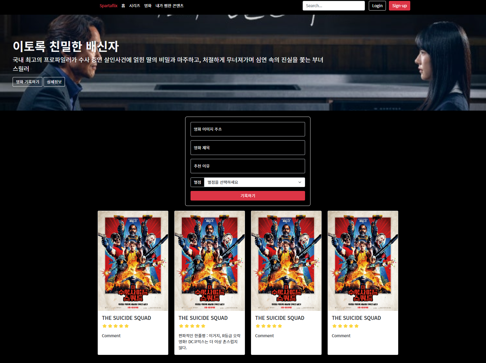

# Sparta_Codingclub

내일배움캠프 백엔드(Spring) 5기 2024-11

🔅취업하자, 나를 위하여 내 사람들을 위하여🔅

사전캠프 2024-11-06 ~ 본캠프

---

## 📁 Web_basic → [(사전) 웹개발종합반](https://spartacodingclub.kr/online/web_basic)

- 노션 토글열기 `ctrl + alt + T`
- 뼈대자동완성 `! + ↵` 혹은 `html:5 + ↵`
- 파일브라우저열기 `alt + B`
- [커밋합치기](https://naradesign.github.io/git-commit-fixup-squash.html) `git rebase -i HEAD~갯수`

### **1주차** | HTML/CSS기초

- 태그는 외우는 것이 아니고 검색해서 가져다가 쓰는 것이다
- CSS는 요소(element)에 명찰을 붙이고 그 명찰을 부르는 형식으로 꾸밀 수 있다.
- 오타나니까 자동완성이 가능한 것들은 굳이 타이핑하지말고 `tab`으로 자동완성하기
- **사용한 Tags** : `div 구획나누기` `h1~6제목` `input입력창` `button`
- **사용한 CSS properties**
  - `width` `height` `color` `background-color`
  - `border-radius` `margin경계밖공백` `padding경계안공백`
    - **value**: `auto 끝까지민다`
  - 배경이미지SET `background-image` `background-size` `background-position`
  - `box-shadow: 0px 0px 3px 0px blue;`
- 여러 요소를 같이 이동시키려면 : 박스 씌우기 (e.g. `
`)
  - 박스를 만들때는 박스범위를 모르니 `background-color:green;` 로 가시화해주기
- 무언가를 가운데 둔다는 것 = 양쪽마진을 최대한 동등하게 밀어두는 것
  - 끝까지 민다`auto`를 사용 ! e.g. `margin: 20px auto 0px auto;`
- 박스 속 모든 내용물 정렬
  - `display: flex;` 플렉스박스로 만들겠음
  - `flex-direction: column;` 아이템-정렬:세로로
  - `justify-content: center;`
  - `align-items: center;`
- 남이 만들어 놓은 예쁜 CSS 꾸러미 → `Bootstrap부트스트랩` ─ _붓을 쥘 줄 아는 것과 그림을 예쁘게 그릴 줄 아는 것은 다른 겁니다._

### **2주차** | Javascript

↓ **1주차 복습** | Spartaflix

Javascript : 움직임부여/서버통신

- `let 변수명 = 변수값 ;` 변수선언, 초기화
- `console.log(변수명)` console에 변수값 출력
  - 왜 출력? 개발자를 위해서
- list
  - 같은 종류의 변수를 몇 백개 만들어야 할 때 사용 → 하나의 리스트에 몇 백개의 값을 저장
  - 선언 : `let 변수명 = [값0, 값1, ];`
  - 사용 : `변수명[Index];`
- dictionary
  - 한 개체에 관련된 값들일 때 사용 → 하나의 딕셔너리에 키:값 으로 저장
  - 선언 : `let 변수명 = {'카1':값1, '키2':값2, };`
  - 사용 : `변수명[키];`
    > 코딩을 하면서 문법의 규칙을 일원화하려고 생각하시면 절대 안됩니다.
    >
    > - 꺾쇠는 어디에 쓰는거고... 중괄호는 어디에 쓰는거고... 이렇게 시작을 하면 절대로 코딩을 이해하거나 쉽게 잘해지기가 어렵습니다. 왜냐면요 그렇게 만들어지지 않았거든요.  
    >   _"[ ] 는 언제쓰더라?"_ 이렇게 하면 안돼요.
    > - _"Dict에서 값을 가지고 나올 때 [ ]를 쓴다"_ 이렇게 이해해야해요. 통단위로 이해해주세요.
- 조건문 : `if (조건) { 실행문 }` `else { 실행문 };`
- 반복문 : `꾸러미 수만큼 → list` 반복해라
  - let ages = [15, 30, 11, 25, 65, 13, 21, 32];  
    // 어떤 어레이를 for each만큼 돌려서 써먹는다  
    let i = 0;  
    ages`.forEach((`element`) => {`  
    　 i += 1;  
    　 if (element < 20) {  
    　　 console.log("[" + i + "] 나이 " + element + "살 : 청소년입니다.");  
    　} else {  
    　　 console.log("[" + i + "] 나이 " + element + "살 : 성인입니다.");  
    　}  
    `});`
- 함수 : 선언 `function 함수명() {` `}`
- JQuery - 누군가 만들어놓은 Javascript Library
  - $(selector)로 사용하는 것 같은데 아직은 감이 안 잡힘
-
