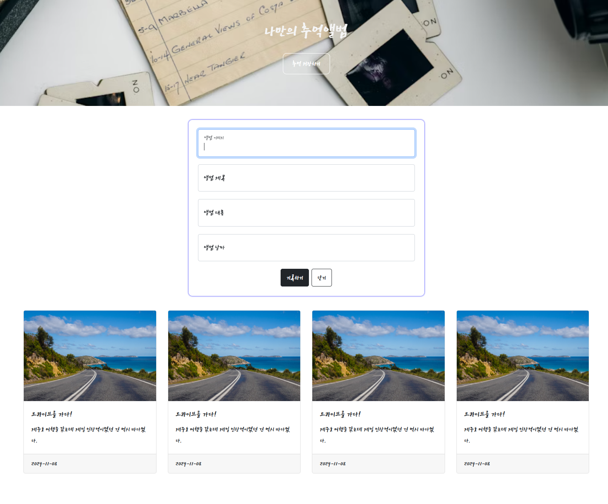

# Sparta_Codingclub

내일배움캠프 백엔드(Spring) 5기 2024-11  
🔅취업하자, 나를 위하여 내 사람들을 위하여🔅

---

## 사전캠프 2024-11-06 ~ 본캠프

### 📁 Web_basic → [(사전) 웹개발종합반](https://spartacodingclub.kr/online/web_basic)

- 노션 토글열기 `ctrl + alt + T`
- 뼈대자동완성 `! + ↵` 혹은 `html:5 + ↵`
- 파일브라우저열기 `alt + B`

**1주차**

- 태그는 외우는 것이 아니고 검색해서 가져다가 쓰는 것이다
- CSS는 요소(element)에 명찰을 붙이고 그 명찰을 부르는 형식으로 꾸밀 수 있다.
- 오타나니까 자동완성이 가능한 것들은 굳이 타이핑하지말고 `tab`으로 자동완성하기
- **사용한 Tags** : `div 구획나누기` `h1~6제목` `input입력창` `button`
- **사용한 CSS properties**
  - `width` `height` `color` `background-color`
  - `border-radius` `margin경계밖공백` `padding경계안공백`
    - **value**: `auto 끝까지민다`
  - 배경이미지SET `background-image` `background-size` `background-position`
  - `box-shadow: 0px 0px 3px 0px blue;`
- 여러 요소를 같이 이동시키려면 : 박스 씌우기 (e.g. `
`)
  - 박스를 만들때는 박스범위를 모르니 `background-color:green;` 로 가시화해주기
- 무언가를 가운데 둔다는 것 = 양쪽마진을 최대한 동등하게 밀어두는 것
  - 끝까지 민다`auto`를 사용 ! e.g. `margin: 20px auto 0px auto;`
- 박스 속 모든 내용물 정렬
  - `display: flex;` 플렉스박스로 만들겠음
  - `flex-direction: column;` 아이템-정렬:세로로
  - `justify-content: center;`
  - `align-items: center;`
- 남이 만들어 놓은 예쁜 CSS 꾸러미 → `Bootstrap부트스트랩` ─ _붓을 쥘 줄 아는 것과 그림을 예쁘게 그릴 줄 아는 것은 다른 겁니다._

## 
